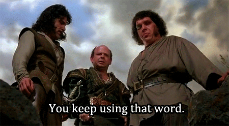

[](https://github.com/iPlexor/Hello-GitHub/actions/workflows/dotnet.yml)
 
 # Hello World

Since I can't publicly share 99.999% of my code on GitHub, here's a _simple_ Hello World program in C# to show you how _not_ to code.

Realistically, this is a MarkDown project about problem solving with snippets of C#, exposeing how bloody silly and frustrating coding can be.


Technically its the default project template for a C# Console App, but we can't 💯% test that. A crying shame, because this is ostensibly a 1 line program thanks to Top Level Statements. But the whole thing unravels quickly if you have the audacity to test it.

\#TLDR Probably don't.

## Starting Template


## Problem 1: Making it testable

So to make it testable, we add a test project.

1. Add an `XUnit` test project.
1. Add a reference the `HelloWorld` project.
   >Error: Main is inaccessible, your tests can't see it.

This is frustrating, but by default Top Level Statements gives you this implementation under the hood:

```csharp
internal class Program
{
    static void Main(string[] args)
    {
        // This is a simple C# program that prints "Hello, World!" to the console.
        Console.WriteLine("Hello, World!");
    }
}
```

The `internal` for `Program` looks promising, but sadly `Main` defaults to `private`. That's our problem.

So we lose our beautiful 1-liner, just so we can set `Program` and `Main` to `public`.

Cool, now we can add tests and they'll pass.

`Pro Tip:` If you're doing TDD, remember to _pretend_ you wrote the failing tests _before_ you wrote the code to make them pass.

```csharp
namespace HelloWorld.Tests;

public class HelloWorldTests
{
    [Fact]
    public void HelloWorld_Prints_HelloWorld()
    {
        // Arrange
        var writer = new StringWriter();
        Console.SetOut(writer);

        // Act
        Program.Main(default!);

        // Assert
        Assert.Equal("Hello, World!", writer.ToString().Trim());
    }

    [Fact]
    public void HelloWorld_Never_Wawaweewah()
    {
        // Arrange
        var writer = new StringWriter();
        Console.SetOut(writer);

        // Act
        Program.Main(default!);

        // Assert
        Assert.NotEqual("Wawaweewah!", writer.ToString().Trim());
    }
}
```

Now everything is `public`. _**Inconceivable**_!


We'll fix that later.

## Problem 2: Measuring Code Coverage

The easy, but very expensive way to do this is to buy a Visual Studio Enterprise license and switch Code Coverage on. If you prefer to save a few grand a year, you're not going to do that.

Instead, we'll use `Coverlet` to generate code coverage metrics when we run our tests and use `ReportGenerator` to show us the results.

1. Add the `Coverlet.MSBuild` NuGet package to the both projects.

   ```powershell
   dotnet add package coverlet.msbuild
   ```

1. Install the `ReportGenerator` tool:

   ```powershell
   dotnet tool install -g dotnet-reportgenerator-globaltool
   ```

1. Run the tests and collect coverage using the dotnet test command with an absolute path.

   ```powershell
   dotnet test /p:CollectCoverage=true /p:CoverletOutputFormat=opencover /p:CoverletOutput="$(pwd)/coverage/"
   ```

1. Run the `ReportGenerator` tool:

   ```powershell
   dotnet reportgenerator "-reports:HelloWorld.Tests/coverage.opencover.xml" "-targetdir:coveragereport" "-reporttypes:Html"
   ```

Amazing, 💯% code coverage!

`Pro Tip:` If it doesn't generate `coverage.opencover.xml`, you've successfully reproduced my results. Somethings broken and needs fixing. Good luck!


Congratulations, you're a real Software Engineer now!

## Problem 3: Retaining some dignity

Technically, (nobody cares, but...) `public` is bad. Okay, so is chasing 💯% code coverage. But it's ONE LINE of code, so 100% isn't crazy!

Anyway, since `public` compromised encapsulation and security, we should really make them both `internal`, and give exclusive access only to our tests.

Applying some compiler wizardry 🧙‍♂️ in an `AssemblyInfo.cs`, we specify `InternalsVisibleTo` to make it so.

```csharp
[assembly: InternalsVisibleTo("HelloWorld.Tests")]
```

Problem Solved! But adding `AssemblyInfo.cs` has really screwed up our 1-liner and dropped the code coverage below 💯%. _**Inconceivable!**_

## Problem 4: Achieving 100% test coverage

Ironically, adding `AssemblyInfo.cs` to facillitate testing the code to 💯%, adds a bit of code we can't bloody test!

This impacts the code coverage, so we exclude that from code coverage.

```powershell
dotnet test /p:CollectCoverage=true /p:CoverletOutputFormat=opencover /p:Exclude="[HelloWorldCSharp]*AssemblyInfo.cs"
```

## Conclusion

Much of this sillyness can be avoided, by:

- Creating an `internal` HelloWorld class
- Not chasing minimalism and 💯% code coverage
- Buy a Visual Studio Enterprise license

Technically, `Main` is the entrypoint of `Program`, so testing it is technically an End-to-End test anyway!

Of course, all of this is _**inconceviable!**_ for a Hello World app and all of this is _very_ _VERY_ silly.



If you don't like sillyness, probably don't write code. It's sillyness _all_ the way down!
